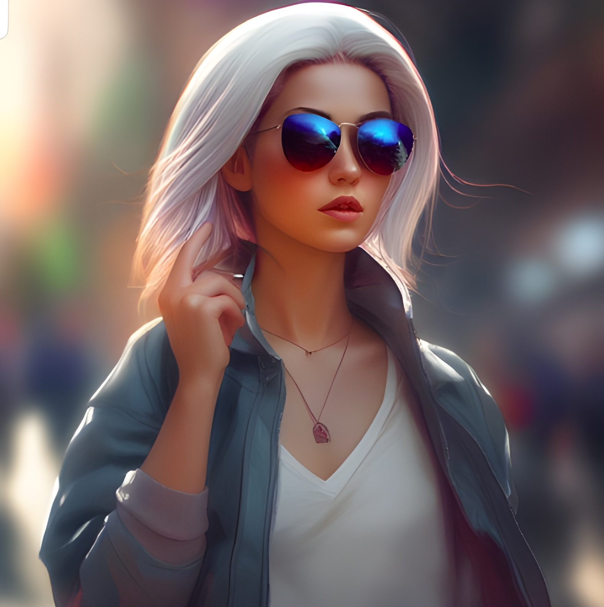

<div align="center" markdown="1">
  
# Stable Diffusion XL Inpainting

[](https://github.com/ayush-thakur02)
[](https://github.com/ayush-thakur02)
[](https://github.com/ayush-thakur02)

</div>

<div align="justify" markdown="1">

Stable Diffusion XL Inpainting is an image inpainting tool based on the Stable Diffusion generative model, designed to fill in missing or corrupted parts of an image with realistic and high-quality content. This project leverages the power of deep learning to perform inpainting tasks and offers state-of-the-art results. 

<div align="center" markdown="1">

Make Sure to follow me:

[](https://github.com/ayush-thakur02)
[](https://bio.link/ayush_thakur02)

</div>

## Table of Contents

- [Installation](#installation)
- [Usage](#usage)
- [Results Sample](#results-sample)

## Installation

<div align="center" markdown="1">

**You can Also Try on Google Colab for free. Open Notebook:**

[](https://colab.research.google.com/drive/1Y7-UzfH7GY95O-l-5AhVj_zwEE4mDqts?usp=sharing)

</div>

Before using Stable Diffusion XL Inpainting, you need to set up the required environment. You can do this by following these steps:

1. Clone the repository:

   ```bash
   git clone https://github.com/yourusername/stable-diffusion-xl-inpainting.git
   cd xl-inpainting
   ```

2. Install the necessary dependencies. It is recommended to use a virtual environment:

   ```bash
   python -m venv venv
   source venv/bin/activate  # On Windows, use 'venv\Scripts\activate'
   pip install -r requirements.txt
   ```

## Usage

To use Stable Diffusion XL Inpainting, simply run the following command in your terminal:

```bash
python inpaint.py
```

This command will launch the application, and a Gradio link will appear, allowing you to interactively inpaint images using the Stable Diffusion generative model. Gradio provides an intuitive and user-friendly interface for selecting input images, specifying masks, and instantly generating inpainted results. It streamlines the inpainting process and makes it accessible to users with minimal technical expertise.

## Results Sample

Below is an example of inpainting results achieved with Stable Diffusion XL Inpainting:


*Input Image*



*Output Image (Inpainting Result)*

## Contribute

If you come across any errors or bugs, please don't hesitate to reach out via email, or feel free to create an issue ticket. Also, if you have any ideas or suggestions for enhancements, we'd love to hear from you. Your feedback and contributions are invaluable in improving this resource. Thank you for your collaboration in making this even better! 😊

</div>
